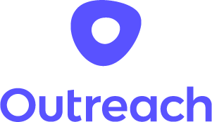
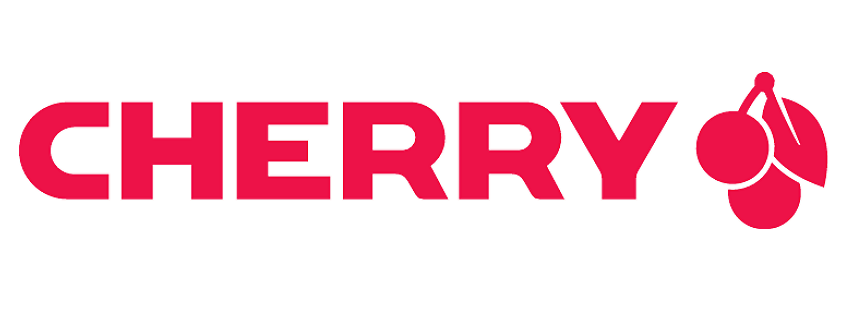
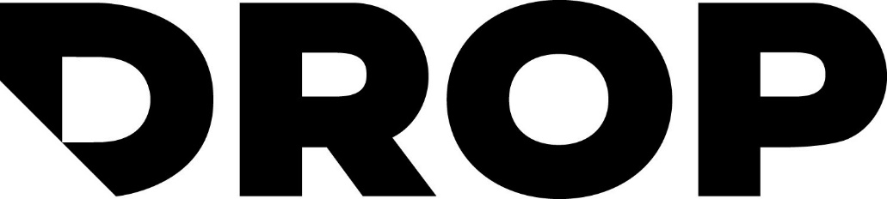
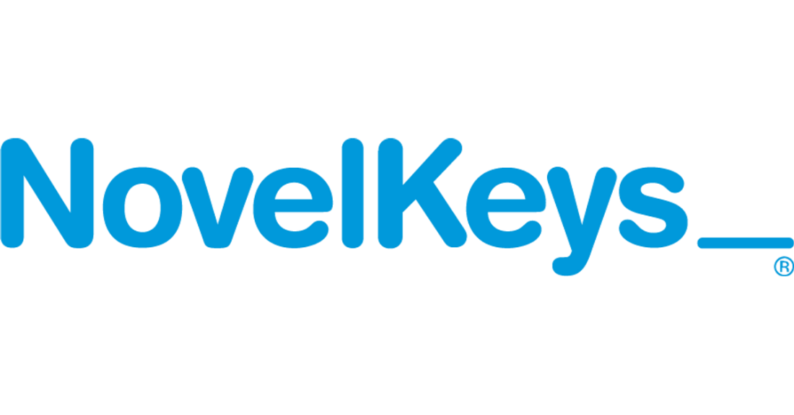
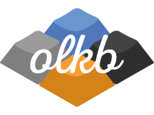
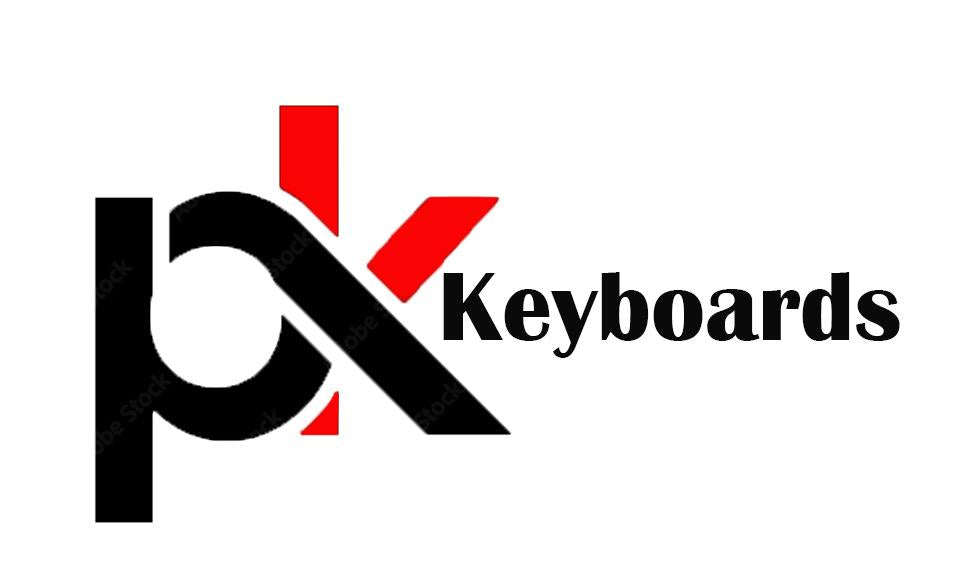

# Indy Mech Meetup 2023

## Date & Time

July 8th, 2023, at 1pm

## Location

### Outreach

342 Massachusetts Ave #300, Indianapolis, IN 46204

### Parking

<iframe src="https://www.google.com/maps/embed?pb=!1m16!1m12!1m3!1d3066.5475208939906!2d-86.153453!3d39.7722665!2m3!1f0!2f0!3f0!3m2!1i1024!2i768!4f13.1!2m1!1sparking!5e0!3m2!1sen!2sus!4v1688316536714!5m2!1sen!2sus" width="600" height="450" style="border:0; width: 100%;" allowfullscreen="" loading="lazy" referrerpolicy="no-referrer-when-downgrade"></iframe>

## Schedule

- Free time (talk, look around, admire, mingle)
- Solder, lube, etc. demonstration
- Free time (talk, look around, admire, mingle)
- Giveaway

## RSVP
<a href="https://docs.google.com/forms/d/e/1FAIpQLSelK-sTB4lcGf91e8OXnkzzijyDbKKELmBa2Kc5mkn_O-WkAA/viewform" >Click here to RSVP</a>

## Sponsors

    
    
    
    
    
    
    

## About The Organizers

### Eric Kong

Hello everyone! My name is Eric Kong and I got introduced to the mechanical keyboard community / hobby in 2016. The first meetup I attended was the 2018 Indianapolis meetup. Since then, I went to the Columbus, OH meet in 2021, the Iowa meet in spring 2022, and the Minnesota meet in fall 2022. We were planning an Indiana meetup for 2020 but that was canceled due to COVID.

### Andrew Brice

Hello! I’m a software engineer with a background in graphic design. I first discovered mechanical keyboards when a coworker showed me their Keychron K1 in 2019, and it’s been down the rabbit hole ever since. My daily driver is a beige NK87 with black Ink v2 switches and off-white keycaps - I’m all about that retro aesthetic!

### Alex Lewis

Hey everyone! I got into mech keyboards around 2018. I built a OLKB Planck an was hooked on the hobby. Since then I’ve cycled through a number of keyboards before landing on a Salamander with Fei Matcha switches as my daily driver.
